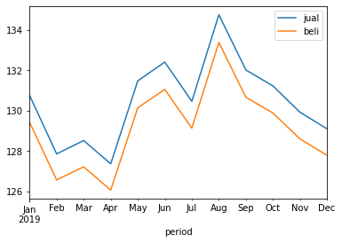

# WebScrapping using BeautifulSoup

This project is developed as a capstone project from Algoritma Academy Data Analytics Specialization with a simple webscrapping case and how to visualise the data with plots

Web Scraping is the process of downloading data from websites and extracting valuable information from the data. 

The source used for this project is from https://monexnews.com/kurs-valuta-asing.htm?kurs=JPY&searchdatefrom=01-01-2019&searchdateto=31-12-2019 which gave a lot of challenges, about the Indonesian type of date time and rounding version in comma (,)

I created an additional columns defined and information of periods of date in month and average of both ask and bid value

Here is the data

And this the plot

# Conclusion

The chart depicts the exchange rate of JPY against the IDR and vice versa in 2019. It shows fluctuative movement both for the ask (jual) and bid (beli) for the following 4 months before dropped significantly in April which marked the lowest number before rose rapidly in June. There was also a sharp fell in July to around 3 points for both then peaked in August, reaching the highest level for both of indicators and it finally faced downward trend until December. Overall, the curve showed a relation between ask (jual) and bid (jual) are always following each other. The lowest point for both components was on April 2019 and the highest point was on August 2019.ways following each other. The lowest point for both components was on April 2019 and the highest point was on August 2019.

From this chart, we also can conclude that ask (jual) number is always higher than bid (beli) number

The volatility of exchage rate mostly affected by the purchasing power of income and capital gains derived from any returns. Moreover, the exchange rate influences other income factors such as interest rates, inflation and even capital gains from domestic securities.
